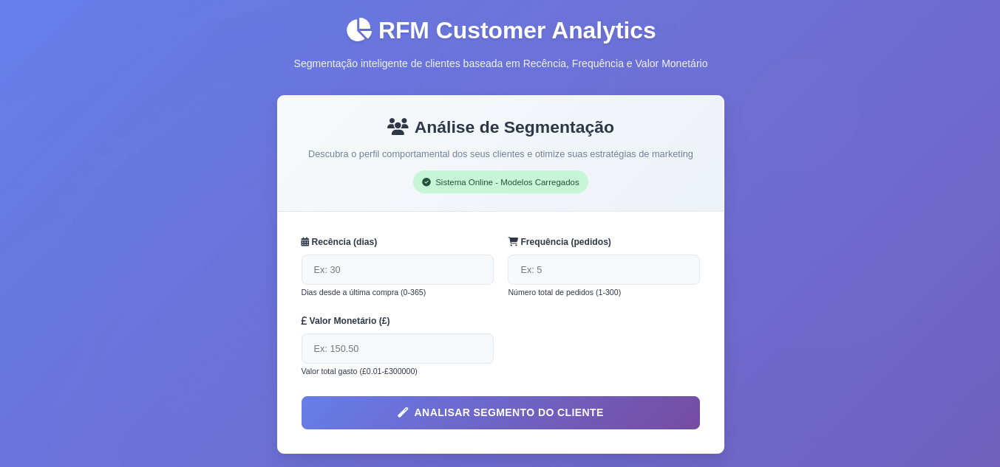
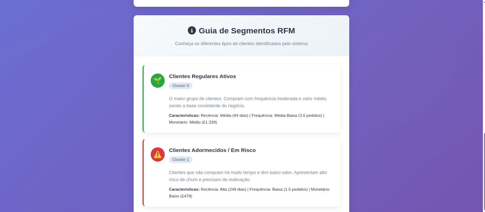

# 🛍️ Sistema de Segmentação RFM - Online Retail

Sistema completo de **segmentação de clientes** usando análise **RFM (Recency, Frequency, Monetary)** com Machine Learning. Desenvolvido para análise do dataset Online Retail, permitindo classificar clientes em diferentes segmentos estratégicos.

## 📊 Sobre o Projeto

Este projeto implementa um pipeline completo de Machine Learning para segmentação de clientes, desde o treinamento dos modelos até uma aplicação web interativa para classificação em tempo real.

### 🎯 Objetivos

- **Segmentação Inteligente**: Classificar clientes em 5 grupos distintos baseados no comportamento de compra
- **Análise RFM**: Utilizar métricas de Recência, Frequência e Valor Monetário
- **Interface Web**: Aplicação Flask para uso prático dos modelos
- **Pipeline Automatizado**: Processo completo desde dados brutos até predições

## 🏗️ Arquitetura do Sistema

```
├── app/
│   ├── app.py                        # Aplicação web Flask
│   └── templates/index.html         # Templates HTML (Flask)
├── data/                          # Dados do projeto
│   └── Online Retail.xlsx         # Dataset principal
├── images/                        # Screenshots da aplicação
│   ├── elbow_curve.png           # Gráfico do método do cotovelo
│   ├── guia_segmentos_rfm_1.png
│   ├── guia_segmentos_rfm_2.png
│   └── tela_principal.png
├── models/                        # Modelos treinados
│   ├── rfm_scaler.pkl            # StandardScaler para normalização
│   └── rfm_kmeans_model.pkl      # Modelo K-Means treinado
├── scripts/  
│   ├── data_cleaner.py               # Módulo de limpeza de dados
│   ├── main.py                       # Script principal de treinamento
│   ├── model_utils.py                # Utilitários para modelos
│   ├── rfm_calculator.py             # Cálculo das métricas RFM
│   └── rfm_segmentation.py           # Segmentação com K-Means
└── requirements.txt              # Dependências do projeto
```

## 🚀 Instalação e Configuração

### 1. Clone o repositório
```bash
git clone https://github.com/josevbrito/online-retail-rfm-analysis.git
cd rfm-customer-segmentation
```

### 2. Instale as dependências
```bash
pip install -r requirements.txt
```

### 3. Prepare os dados
- O arquivo `Online Retail.xlsx` já está na pasta `data/`
- Ou deixe o sistema criar dados simulados automaticamente

### 4. Treine os modelos
```bash
python main.py
```

### 5. Execute a aplicação web
```bash
python app.py
```

A aplicação estará disponível em: `http://localhost:5000`

## 📱 Interface da Aplicação

### Tela Principal


A interface principal permite inserir as métricas RFM de um cliente e obter a classificação instantânea em um dos 5 segmentos.

### Guia de Segmentos RFM - Parte 1


### Guia de Segmentos RFM - Parte 2


A aplicação inclui um guia completo dos 5 segmentos identificados, com características detalhadas e estratégias recomendadas para cada grupo.

## 🎯 Segmentos de Clientes Identificados

### 🌱 Cluster 0: Clientes Regulares Ativos
- **Características**: Recência média (44 dias), Frequência média-baixa (3.6 pedidos), Monetário médio (£1.339)
- **Estratégia**: Focar na retenção e explorar oportunidades de upsell

### ⚠️ Cluster 1: Clientes Adormecidos / Em Risco
- **Características**: Recência alta (249 dias), Frequência baixa (1.5 pedidos), Monetário baixo (£478)
- **Estratégia**: Campanhas de reengajamento com ofertas personalizadas

### 🤝 Cluster 2: Clientes Leais de Alto Valor
- **Características**: Recência baixa (16 dias), Frequência alta (21 pedidos), Monetário alto (£12.832)
- **Estratégia**: Programas de fidelidade e atendimento prioritário

### 🏆 Cluster 3: Super Campeões (Alta Frequência)
- **Características**: Recência muito baixa (6.5 dias), Frequência muito alta (120.5 pedidos), Monetário muito alto (£55.313)
- **Estratégia**: Reconhecimento VIP e acesso antecipado a produtos

### 👑 Cluster 4: Ultra VIPs (Maior Valor Monetário)
- **Características**: Recência muito baixa (7.7 dias), Frequência alta (42.8 pedidos), Monetário extremamente alto (£190.863)
- **Estratégia**: Tratamento exclusivo com gerente de conta dedicado

## 🔧 Uso dos Modelos

### Treinamento
```python
# Execute o pipeline completo de treinamento
python main.py
```

### Predição Individual
```python
from model_utils import load_models, predict_customer_segment_from_transactions

# Carrega os modelos
scaler, kmeans_model = load_models("models")

# Cria transação de exemplo
customer_data = create_sample_transaction()

# Prediz o segmento
result = predict_customer_segment_from_transactions(
    customer_data, scaler, kmeans_model
)

print(f"Cliente classificado no Cluster: {result['Cluster']}")
```

### API REST
```bash
# POST /api/predict
curl -X POST http://localhost:5000/api/predict \
  -H "Content-Type: application/json" \
  -d '{
    "recency": 30,
    "frequency": 5,
    "monetary": 500.0
  }'
```

## 📊 Métricas RFM

### Recency (Recência)
- **Definição**: Dias desde a última compra
- **Faixa**: 0 a 365 dias
- **Interpretação**: Menor valor = cliente mais ativo

### Frequency (Frequência)
- **Definição**: Número total de pedidos únicos
- **Faixa**: 1 a 300 pedidos
- **Interpretação**: Maior valor = cliente mais fiel

### Monetary (Valor Monetário)
- **Definição**: Valor total gasto pelo cliente
- **Faixa**: £0.01 a £300.000
- **Interpretação**: Maior valor = cliente mais valioso

## 🛠️ Tecnologias Utilizadas

- **Python 3.8+**: Linguagem principal
- **scikit-learn**: Machine Learning (K-Means, StandardScaler)
- **pandas**: Manipulação de dados
- **Flask**: Framework web
- **joblib**: Serialização de modelos
- **matplotlib**: Visualizações (método do cotovelo)

## 📈 Pipeline de Machine Learning

1. **Carregamento de Dados**: Leitura do dataset Online Retail
2. **Limpeza**: Remoção de cancelamentos, valores nulos e inválidos
3. **Cálculo RFM**: Agregação por cliente das métricas RFM
4. **Normalização**: StandardScaler para padronizar as features
5. **Clusterização**: K-Means com 5 clusters otimizados
6. **Validação**: Método do cotovelo para determinar K ótimo
7. **Serialização**: Salvamento dos modelos treinados

## 🎮 Exemplos de Uso

### Exemplo 1: Cliente Regular
```
Recência: 45 dias
Frequência: 4 pedidos  
Monetário: £1.200
→ Resultado: Cluster 0 (Clientes Regulares Ativos)
```

### Exemplo 2: Cliente VIP
```
Recência: 5 dias
Frequência: 50 pedidos
Monetário: £25.000
→ Resultado: Cluster 2 (Clientes Leais de Alto Valor)
```

## 🔍 Monitoramento e Health Check

A aplicação inclui endpoints para monitoramento:

- **Health Check**: `GET /health`
- **Status dos Modelos**: Verificação automática do carregamento
- **Logs Estruturados**: Registro detalhado de operações

## 📝 Logs e Debugging

```python
import logging
logging.basicConfig(level=logging.INFO)

# Os logs incluem:
# - Carregamento de modelos
# - Validações de entrada
# - Predições realizadas
# - Erros e exceções
```

## 🚀 Deploy em Produção

### Usando Gunicorn
```bash
gunicorn -w 4 -b 0.0.0.0:5000 app:app
```

### Docker (exemplo)
```dockerfile
FROM python:3.9
COPY . /app
WORKDIR /app
RUN pip install -r requirements.txt
CMD ["gunicorn", "-w", "4", "-b", "0.0.0.0:5000", "app:app"]
```

## 🤝 Contribuição

1. Fork o projeto
2. Crie uma branch para sua feature (`git checkout -b feature/AmazingFeature`)
3. Commit suas mudanças (`git commit -m 'Add some AmazingFeature'`)
4. Push para a branch (`git push origin feature/AmazingFeature`)
5. Abra um Pull Request

## 📄 Licença

Este projeto está sob a licença MIT. Veja o arquivo `LICENSE` para mais detalhes.

## 👥 Autor

**Equipe de Desenvolvimento:**
- José Victor Brito Costa
---

## 📞 Suporte

Para dúvidas, sugestões ou problemas:

1. Abra uma **Issue** no repositório
2. Verifique a seção **Troubleshooting** abaixo
3. Consulte os **logs** da aplicação

### 🔧 Troubleshooting

**Problema**: Modelos não carregados
```
Solução: Execute python main.py para treinar os modelos
```

**Problema**: Erro de importação
```
Solução: pip install -r requirements.txt
```

**Problema**: Dataset não encontrado
```
Solução: Coloque Online Retail.xlsx na pasta data/ ou use dados simulados
```

---

⭐ **Se este projeto foi útil, considere dar uma estrela no repositório!**